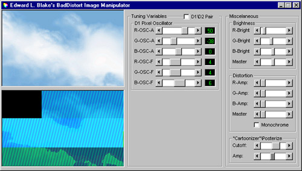



## BadDistort Image Manipulator

### Description

This somewhat strange project demonstrates using the GetPixel and SetPixel functions to separate the color channels and process an image as it's being drawn. Different values can be tweeked as the image is continually filtered. This particular project can distort images with simple filters (Pixel Intensity Oscillation, Channel separated Brightness, both monochrome and non-monochrome Noise Distortion, Posterize).
 
### More Info
 

             |
---                |---
**Submitted On**   |2000-06-29 17:24:36
**By**             |[Edward L\. Blake](https://github.com/Planet-Source-Code/PSCIndex/blob/master/ByAuthor/edward-l-blake.md)
**Level**          |Advanced
**User Rating**    |5.0 (10 globes from 2 users)
**Compatibility**  |VB 3\.0, VB 4\.0 \(16\-bit\), VB 4\.0 \(32\-bit\), VB 5\.0, VB 6\.0, VB Script, ASP \(Active Server Pages\) 
**Category**       |[Custom Controls/ Forms/  Menus](https://github.com/Planet-Source-Code/PSCIndex/blob/master/ByCategory/custom-controls-forms-menus__1-4.md)
**World**          |[Visual Basic](https://github.com/Planet-Source-Code/PSCIndex/blob/master/ByWorld/visual-basic.md)
**Archive File**   |[CODE\_UPLOAD72896292000\.zip](https://github.com/Planet-Source-Code/edward-l-blake-baddistort-image-manipulator__1-9386/archive/master.zip)

